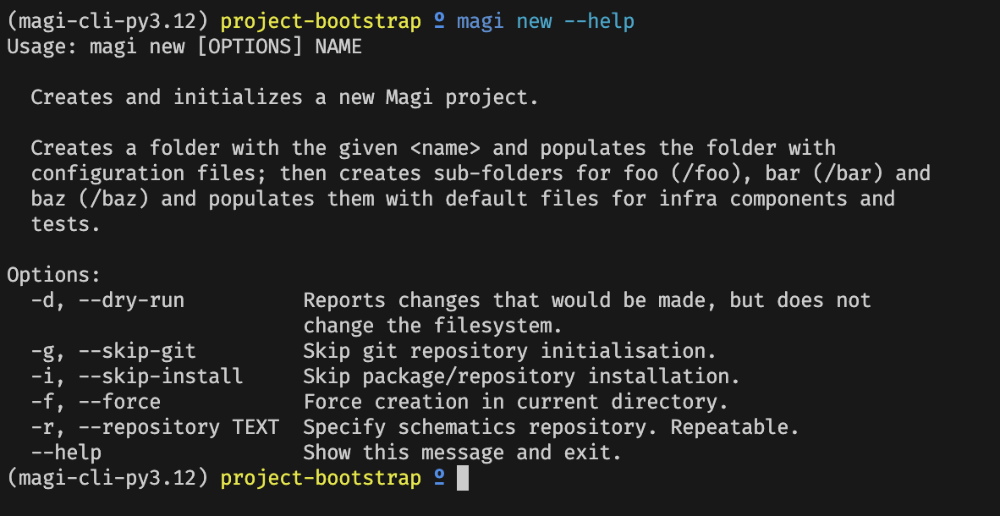

import imageJoshFinch from '@/images/team/josh-finch.jpg'

export const article = {
  date: '2024-03-18',
  title: 'Announcing Magi - A better way to do IaaC',
  description:
    'A batteries-included, cloud-agnostic framework for infrastructure-as-code, using the tools you already love.',
  author: {
    name: 'Josh Finch',
    role: 'Co-Founder / CTO',
    image: { src: imageJoshFinch },
  },
}

export const metadata = {
  title: article.title,
  description: article.description,
}

[Magi](https://magi.sh) is a command-line utility for managing large-scale infrastructure-as-code
projects. At Ologist, we work on these types of projects
for institutions of all shapes and sizes - from government departments to red-brick
universites - and we've learned a few things over the years:

<ul class="list-disc">
<li>Teams spend too much time designing patterns for everyday infrastructure "modes"</li>
<li>Everyone loves tinkering with tooling, often to the detriment of delivering useful work</li>
<li>Onboarding other teams, and promoting collaboration on infrastructure, can require extensive upskilling</li>
</ul>

We are building Magi to solve those problems - by establishing a "firm-but-flexible" template system
for common infrastructure-as-code tasks such building and deploying machine images, 
containers and FaaS functions; deploying secure networks; and handling backup-and-restore.

We're currently in the early stages, crystalising the knowledge we've gained from our
[past engagements](https://ologist.io/work) to build a library of templates and patterns, however we're looking
forward to showing you what we can do.

Oh, and we're always looking for [contributors](https://github.com/ologistio/magi/blob/main/CONTRIBUTING.md)! 
