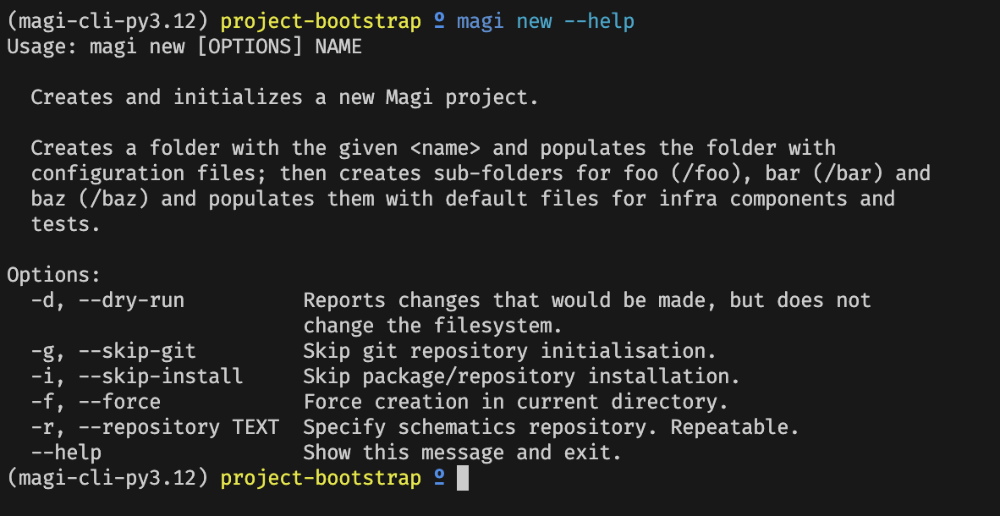

import imageSarahFinch from '@/images/team/sarah-finch.jpg'

export const article = {
  date: '2024-03-18',
  title: 'Announcing Magi - A better way to do IaaC',
  description:
    'Earlier this year we made the bold decision to make everyone come back to the office full-time after two years working from a dressing table in the corner of their bedroom.',
  author: {
    name: 'Sarah-Jane Finch',
    role: 'Co-Founder / CEO',
    image: { src: imageSarahFinch },
  },
}

export const metadata = {
  title: article.title,
  description: article.description,
}

## What is Magi? {{  date: '2024-03-17T00:00Z' }}

Magi is a command-line utility for managing large-scale infrastructure-as-code
projects. At [Ologist](https://ologist.io), we work on these types of projects
for institutions of all shapes and sizes - from government departments to red-brick
universites - and we've learned a few things over the years:

* Teams spend too much time designing patterns for everyday infrastructure "modes"
* Everyone tinkering with tooling, often to the detriment of delivering useful work
* Onboarding other teams, and promoting collaboration on infrastructure, can require extensive upskilling

We are building Magi to solve those problems - by establishing a "firm-but-flexible" template system
for common infrastructure-as-code tasks such building and deploying machine images, 
containers and FaaS functions; deploying secure networks; and handling backup-and-restore.

We're currently in the early stages, crystalising the knowledge we've gained from our
past engagements to build a library of templates and patterns, however we're looking
forward to showing you what we can do.

Oh, and we're always looking for [contributors](https://github.com/ologistio/magi/blob/main/CONTRIBUTING.md)! 

~ Josh Finch [[@openfinch](https://github.com/openfinch)]